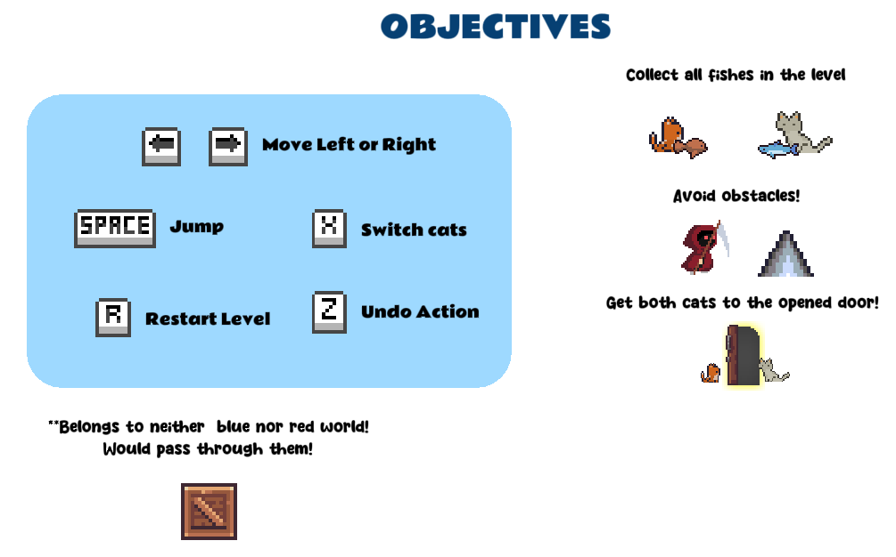

# About
Two In One is a single-player 2D side-view puzzle-platformer game made with GameMaker Studios 2 v2023.1

When Earth had sundered apart, it's up to two friends, torn apart into different worlds, to work together and merge back their worlds; through collecting magical energies in the form of fishes, avoiding traps and enemies, and manipulating certain elements.

In this game, Players are tasked with coordinating between the two cats by switching between them, to solve puzzles and clear levels. The game is completed when the player successfully clear all levels.

<figure>
    
     
    <figcaption align = "center">
      <i>You can play the game <a href="https://lapisraider.itch.io/two-in-one">here</a> </i>
    </figcaption>
</figure>

# How to play
<figure>
    
</figure>

# Assets

## Art and Animation Sprites
1. **Orange Cat**: [Cat 50+ animations](https://bowpixel.itch.io/cat-50-animations). Done by [Bow.Pixel](https://bowpixel.itch.io/)
2. **Gray Cat**: [Cat 38+ Animations](https://bowpixel.itch.io/one-cat). Done by [Bow.Pixel](https://bowpixel.itch.io/)
3. **Fishes** : [Free Fishing Pixel Art Pack](https://free-game-assets.itch.io/free-fishing-pixel-art-pack). Done by [Free Game Assets (GUI, Sprite, Tilesets)](https://free-game-assets.itch.io/)
4. **Crate and Door**: [Dungeon Platformer Tile Set (Pixel Art)](https://incolgames.itch.io/dungeon-platformer-tile-set-pixel-art) Done by [David G](https://incolgames.itch.io/)
5. **Spikes**: [Spikes](https://omniclause.itch.io/spikes). Done by [Omniclause](https://omniclause.itch.io/)
6. **Tileset**: [Cavernas](https://adamatomic.itch.io/cavernas). Done by [Adam Saltsman](https://adamatomic.itch.io/)
7. **Reaper enemy**: [Reaper (Animated Pixel Art)](https://samuellee.itch.io/reaper-animated-pixel-art). Done by [SamuelLee](https://samuellee.itch.io/)
8. **Pause Icon**: [Pause icon](https://www.flaticon.com/free-icons/pause). Created by [Chanut](https://www.flaticon.com/authors/chanut) - Flaticon
9. **Question Mark Icon** [Question icons](https://www.flaticon.com/free-icons/question). Created by [Roundicons](https://www.flaticon.com/authors/roundicons) - Flaticon
10. **Sound Icon**: [Speaker icons](https://www.flaticon.com/free-icons/speaker). Created by [Freepik](https://www.flaticon.com/authors/freepik) - Flaticon
11. **Mute Icon**: [Mute icons](https://www.flaticon.com/free-icons/mute). Created by [Mayor Icons](https://www.flaticon.com/authors/mayor-icons) - Flaticon
12. **Play Icon**: [Google play music icon](https://www.flaticon.com/free-icons/google-play-music). Created by [Freepik](https://www.flaticon.com/authors/freepik) - Flaticon
13. **Close Icon**: [Close icon](https://www.flaticon.com/free-icons/close). Created by [ariefstudio](https://www.flaticon.com/authors/ariefstudio) - Flaticon
14. **Background**: [Free Sky Backgrounds](https://free-game-assets.itch.io/free-sky-with-clouds-background-pixel-art-set). Done by [Free Game Assets (GUI, Sprite, Tilesets)](https://free-game-assets.itch.io/)

## Sound Effects
1. **Jump**: [SFX_Pickup_03](https://freesound.org/people/jalastram/sounds/317684/). Done by [jalastram](https://freesound.org/people/jalastram/sounds/317684/)
2. **Pickup fish**: [Retro_Coin_05](https://freesound.org/people/MATRIXXX_/sounds/443258/). Done by [MATRIXXX_](https://freesound.org/people/MATRIXXX_/)
3. **Death by spikes**: [SFX_Pickup_33](https://freesound.org/people/jalastram/sounds/317728/). Done by [jalastram](https://freesound.org/people/jalastram/sounds/317684/)
4. **Death by enemies**: [SFX_Pickup_27](https://freesound.org/people/jalastram/sounds/317706/). Done by [jalastram](https://freesound.org/people/jalastram/sounds/317684/)
5. **Death by falling**: [SFX_Pickup_15](https://freesound.org/people/jalastram/sounds/317720/). Done by [jalastram](https://freesound.org/people/jalastram/sounds/317684/)
6. **Going to next level**: ["Win" Video Game Sound](https://freesound.org/people/EVRetro/sounds/495005/). Done by [EVRetro](https://freesound.org/people/EVRetro/)
7. **Undo**: [Retro Inspect Sound, UI, or In-Game Notification](https://freesound.org/people/MATRIXXX_/sounds/658266/). Done by [MATRIXXX_](https://freesound.org/people/MATRIXXX_/)
8. **Unlock Door**: [Door Unlock](https://freesound.org/people/angelkunev/sounds/519065/). Done by [angelkunev](https://freesound.org/people/angelkunev/)
9. **Platform moving**: [sliding wooden door close mic follow door scrape 2](https://freesound.org/people/MattRuthSound/sounds/381966/). Done by [MattRuthSound](https://freesound.org/people/MattRuthSound/)
10. **UI button presses**: [Button Click 2](https://freesound.org/people/Mellau/sounds/506053/). Done by [Mellau](https://freesound.org/people/Mellau/)
11. **Stand on and away from button**: [Door opening](https://freesound.org/people/pointparkcinema/sounds/407242/). Done by [pointparkcinema](https://freesound.org/people/pointparkcinema/)
12. **Scene closing and opening animation**: [Close curtains](https://freesound.org/people/AlienXXX/sounds/348590/). Done by (AlienXXX)[https://freesound.org/people/AlienXXX/]
13. **Box moving**: [Pushing chair](https://freesound.org/people/santiagogra/sounds/532983/). Done by [santiagogra](https://freesound.org/people/santiagogra/)
14. **Swap cat**: [Synth ui interface button netural switch swap](https://freesound.org/people/ryusa/sounds/531145/). Done by [ryusa](https://freesound.org/people/ryusa/)
15. **Typing text for cutscene**: [wKey](https://freesound.org/people/UberBosser/sounds/421581/). Done by [UberBosser](https://freesound.org/people/UberBosser/)
16. **Box dropping onto the floor**: [box crash](https://freesound.org/people/animationIsaac/sounds/149899/). Done by [animationIsaac](https://freesound.org/people/animationIsaac/)

## Background Music
1. **Normal Game Music**: [Play Again - Classic Arcade Game](https://pixabay.com/music/video-games-play-again-classic-arcade-game-116820/). Done by [Dream-Protocol](https://pixabay.com/users/dream-protocol-9556087/)
2. **Main Menu**: [Running Out - Classic Arcade Game](https://pixabay.com/music/video-games-running-out-classic-arcade-game-116823/) Done by [Dream-Protocol](https://pixabay.com/users/dream-protocol-9556087/)
3. **Final level**: [Platform Madness - Classic Arcade Game](https://pixabay.com/music/video-games-platform-madness-classic-arcade-game-116819/) Done by [Dream-Protocol](https://pixabay.com/users/dream-protocol-9556087/)
4. **End Victory Music**: [Victory Game - Classic Arcade Game](https://pixabay.com/music/video-games-victory-game-classic-arcade-game-116830/). Done by [Dream-Protocol](https://pixabay.com/users/dream-protocol-9556087/)

## Fonts
1. **Purple Smile**: [Purple Smile font](https://www.dafont.com/purple-smile.font?text=Titan+One). Copyright (c) 2023 Khurasan (khurasantype@gmail.com)
2. **Rammetto**: [Rammetto One font](https://fonts.google.com/specimen/Rammetto+One). Copyright (c) 2011 by vernon adams (vern@newtypography.co.uk)
3. **Permanent Marker**: [Permanent Marker font](https://fonts.google.com/specimen/Permanent+Marker) Copyright (c) 2011 by Font Diner (licensing@fontdiner.com)
4. **EBGaramond**: [EB Garamond](https://fonts.google.com/specimen/EB+Garamond) Copyright 2017 The EB Garamond Project Authors (https://github.com/octaviopardo/EBGaramond12)
